[![Contributors][contributors-shield]][contributors-url]
[![Forks][forks-shield]][forks-url]
[![Stargazers][stars-shield]][stars-url]
[![Issues][issues-shield]][issues-url]
[![MIT License][license-shield]][license-url]

# Torob
Internet Engineering Spring 2022 Course Project

#### Authors
- Aida Aminian
- Fateme Ahsan

## Technologies
- Front-End: ReactJS
- Back-End: Django

## Project Main Features

- registering account
- checking the format of password and email
- login and logout
- searching products
- viewing products based on category, subcategory or brand
- filtering products based on cost
- sorting products by newest, highest price or lowest price
- viewing product details
- viewing products shop details
- reporting shop products
- adding products to favorites
- removing products from favorites
- viewing favorites
- viewing recent visits
- changing email and phone number
- adding existing products to the shop
- creating new products and adding to the shop
- creating new shops
- viewing reports of shop

## Demo

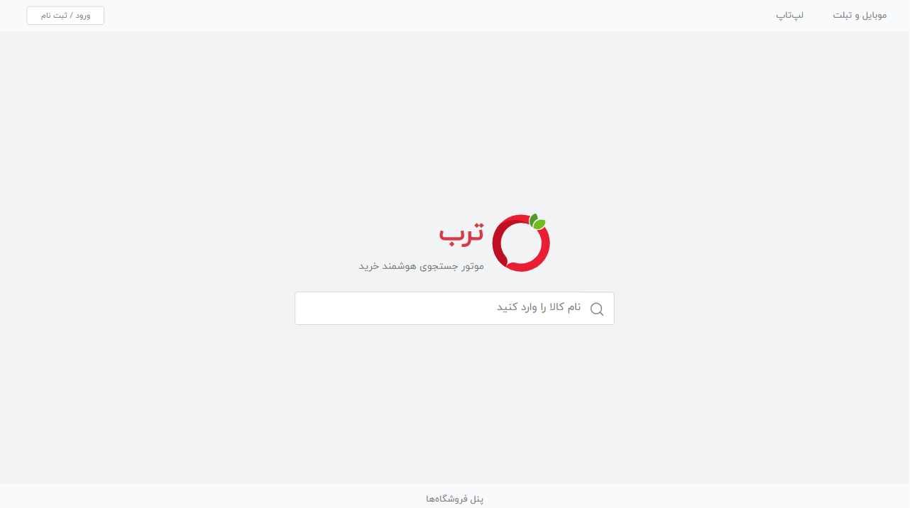
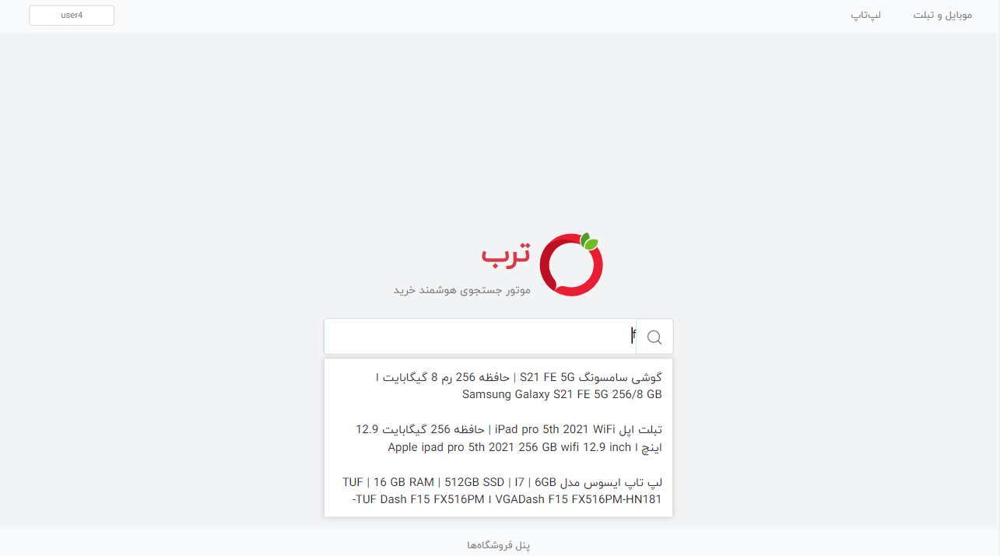
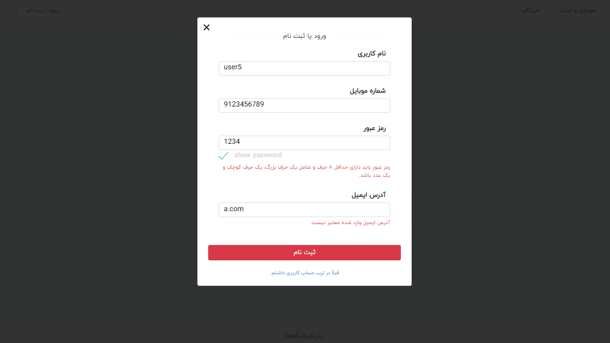
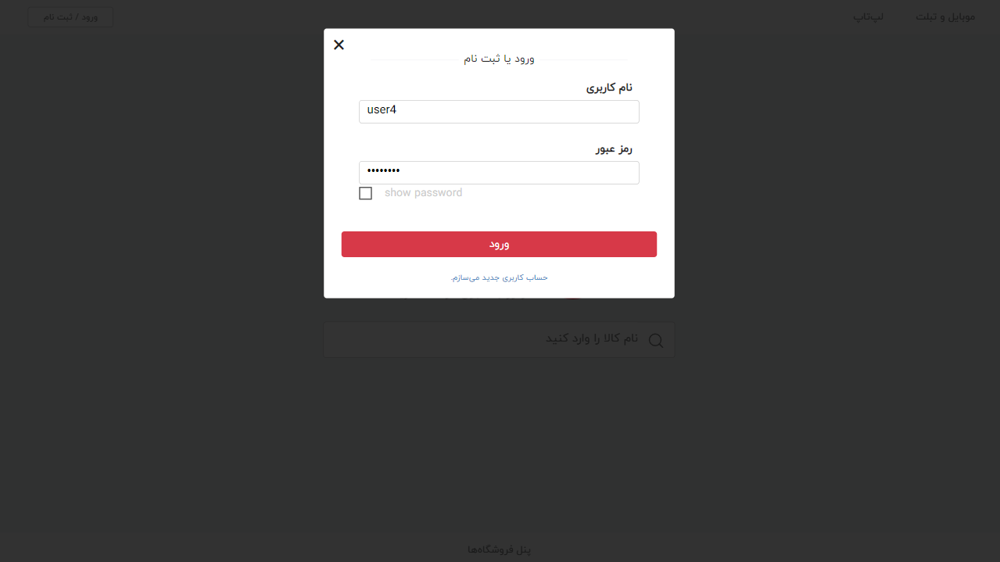
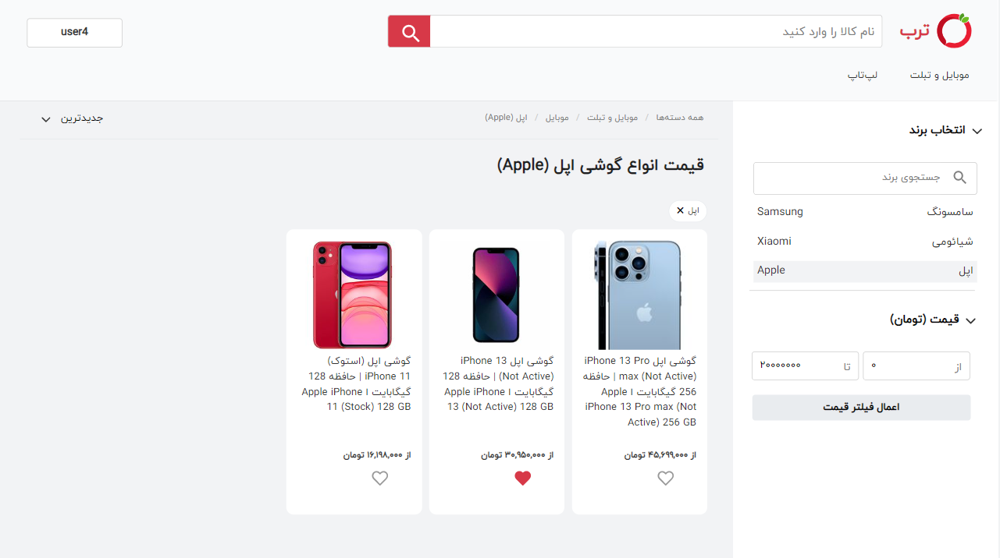
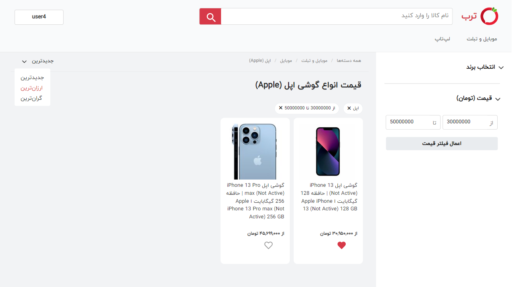
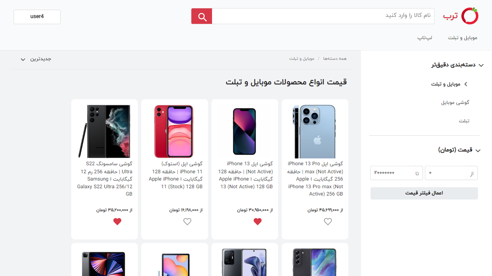
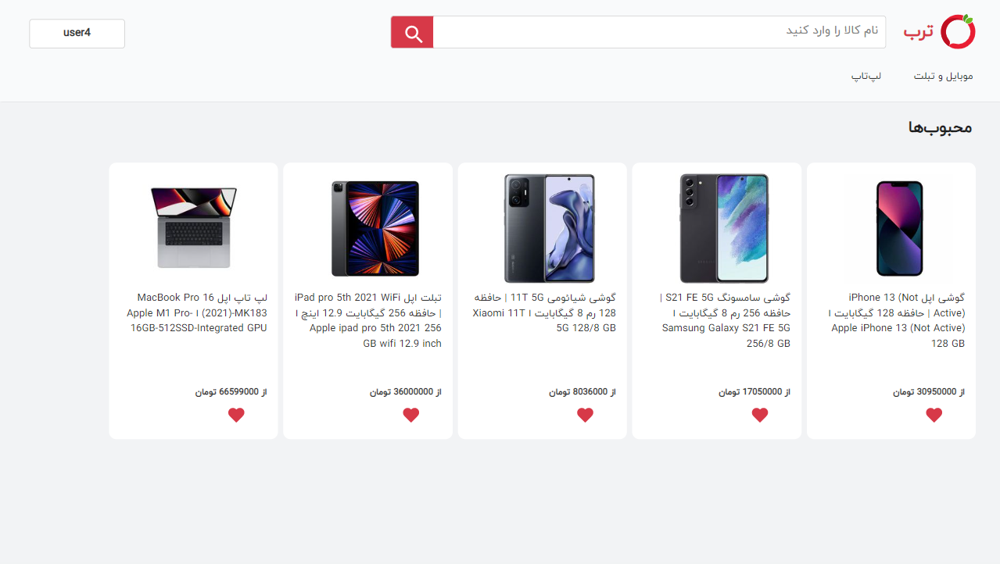
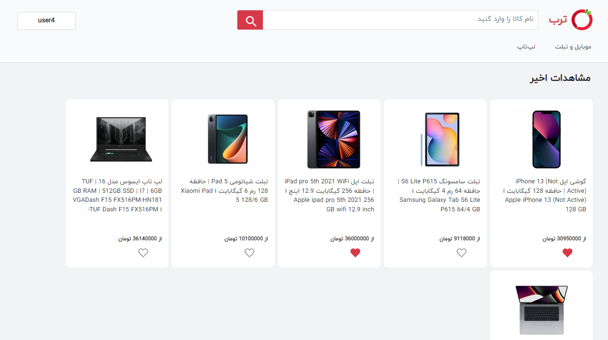
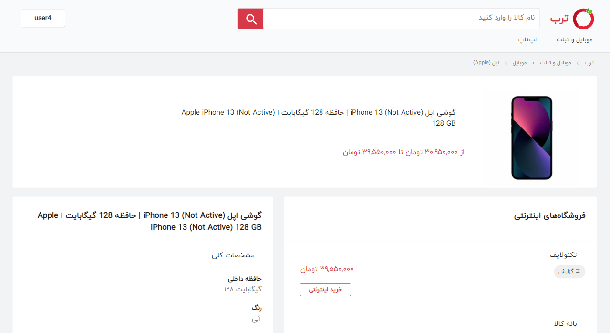
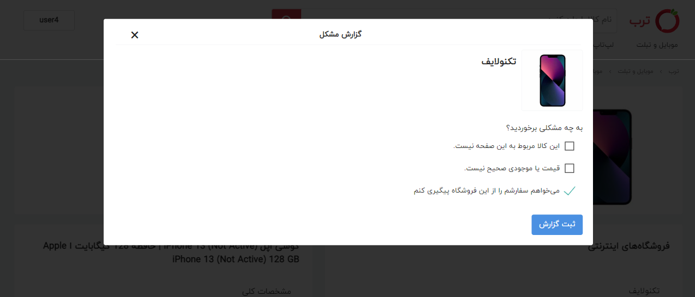
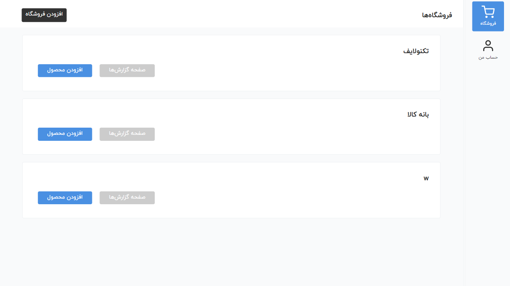
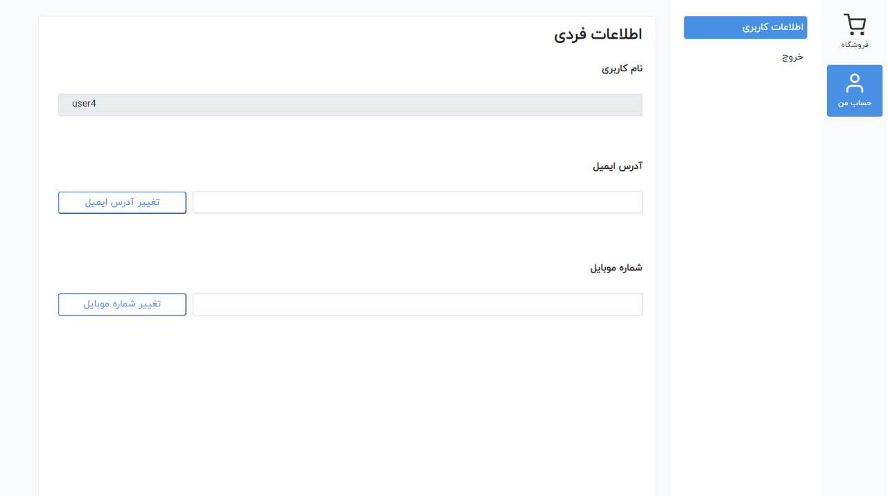
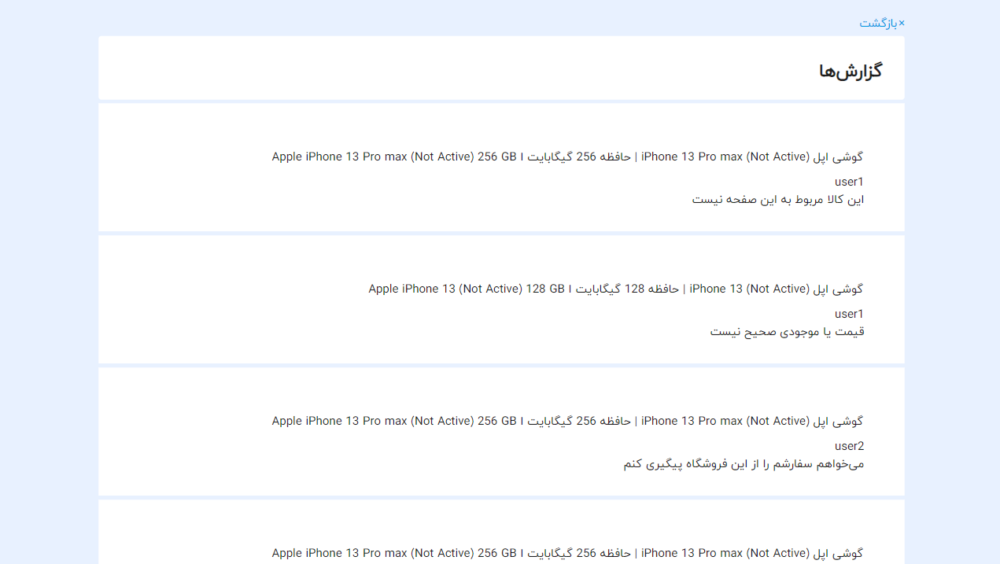
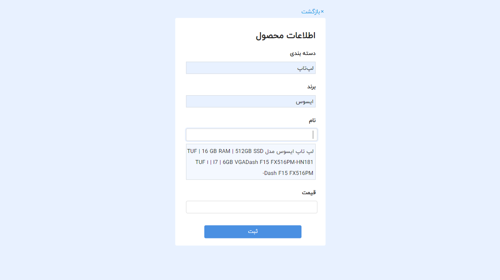
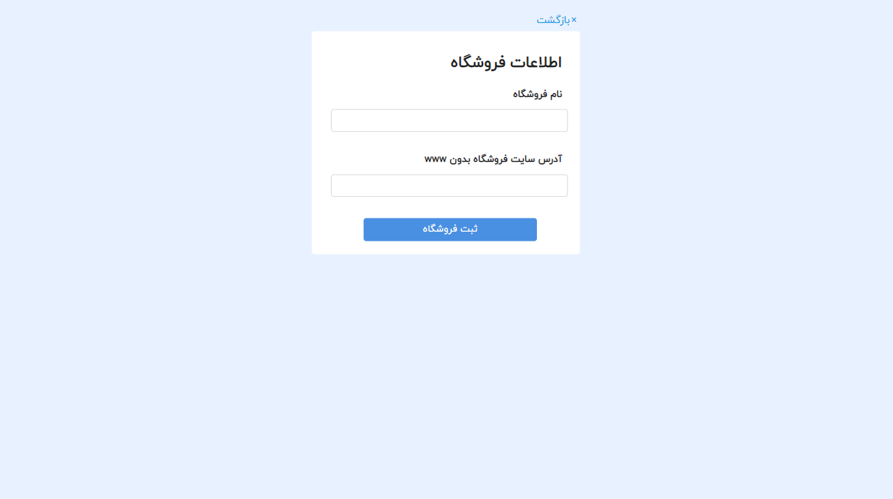
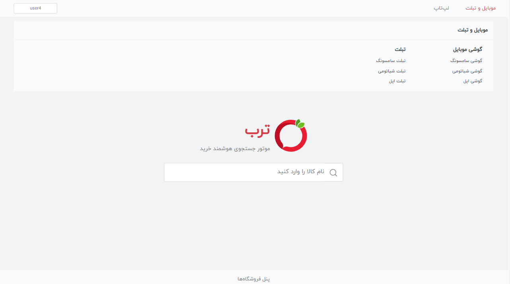

## Contributing 

Contributions are what make the open source community such an amazing place to learn, inspire, and create. Any contributions you make are **greatly appreciated**.

If you have a suggestion that would make this better, please fork the repo and create a pull request. You can also simply open an issue with the tag "enhancement".

1. Fork the Project
2. Create your Feature Branch (`git checkout -b feature/AmazingFeature`)
3. Commit your Changes (`git commit -m 'Add some AmazingFeature'`)
4. Push to the Branch (`git push origin feature/AmazingFeature`)
5. Open a Pull Request

<!-- MARKDOWN LINKS & IMAGES -->
<!-- https://www.markdownguide.org/basic-syntax/#reference-style-links -->
[contributors-shield]: https://img.shields.io/github/contributors/aidaaminian/Torob.svg?style=for-the-badge
[contributors-url]: https://github.com/aidaaminian/Torob/graphs/contributors
[forks-shield]: https://img.shields.io/github/forks/aidaaminian/Torob.svg?style=for-the-badge
[forks-url]: https://github.com/aidaaminian/Torob/network/members
[stars-shield]: https://img.shields.io/github/stars/aidaaminian/Torob.svg?style=for-the-badge
[stars-url]: https://github.com/aidaaminian/Torob/stargazers
[issues-shield]: https://img.shields.io/github/issues/aidaaminian/Torob.svg?style=for-the-badge
[issues-url]: https://github.com/aidaaminian/Torob/issues
[license-shield]: https://img.shields.io/github/license/aidaaminian/Torob.svg?style=for-the-badge
[license-url]: https://github.com/aidaaminian/Torob/blob/master/LICENSE.txt
